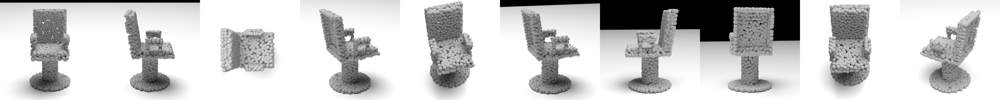

# pointcloud dataset
dataset for paper "Exploiting GPT-4 Vision for Zero-shot Point Cloud Understanding"

## ModelNet40
ModelNet40 dataset contains 12,311 pre-aligned shapes from 40 categories, which are split into 9,843 (80%) for training and 2,468 (20%) for testing. The link for official dataset is [here](http://3dvision.princeton.edu/projects/2014/3DShapeNets/ModelNet10.zip).

The 40 categories include: `airplane`, `bathtub`, `bed`, `bench`, `bookshelf`, `bottle`, `bowl`, `car`, `chair`, `cone`, `cup`, `curtain`, `desk`, `door`, `dresser`, `flower_pot`, `glass_box`, `guitar`, `keyboard`, `lamp`, `laptop`, `mantel`, `monitor`, `night_stand`, `person`, `piano`, `plant`, `radio`, `range_hood`, `sink`, `sofa`, `stairs`, `stool`, `table`, `tent`, `toilet`, `tv_stand`, `vase`, `wardrobe`, `xbox`.

**Note**: The widely used 2,048 points sampled ModelNet40 dataset ([link](https://shapenet.cs.stanford.edu/media/modelnet40_ply_hdf5_2048.zip)) only contains 9,840 shapes for training, not 9,843 in official. Our ModelNet40 dataset fixs this problem and can substitute the above mentioned dataset perfectly.

## ModelNet10
ModelNet10 dataset is a part of ModelNet40 dataset, containing 4,899 pre-aligned shapes from 10 categories. There are 3,991 (80%) shapes for training and 908 (20%) shapes for testing. The link for official dataset is [here](http://modelnet.cs.princeton.edu/ModelNet40.zip).

The 10 categories include: `bathtub`, `bed`, `chair`, `desk`, `dresser`, `monitor`, `night_stand`, `sofa`, `table`, `toilet`.

## visualizations
+ 6 views

+ 10 views

